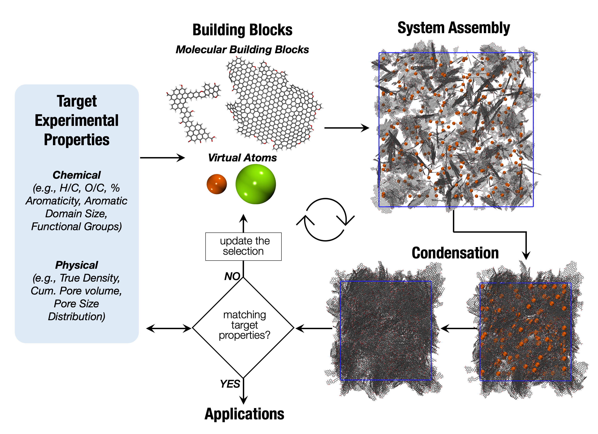

# Biochar Molecular Models with Microporocity

By Audrey Ngambia (a.l.noumbissi-ngambia@sms.ed.ac.uk) and Valentina Erastova (valentina.erastova@ed.ac.uk),
University of Edinburgh


**Please cite as**: 

A. Ngambia, O. Masek, V. Erastova, *Development of biochar molecular models with controlled porosity.* [https://doi.org/10.48550/....](https://doi.org/10.48550/....)

---

### Molecular models of porous woody biochars produced at 600ºC - 650ºC highest treatment temperatures


The structure of the shared files as follows:

**`Model_BCMA`** - BCMA model, using uniform sizes of building blocks 

*  `model.gro` - gromacs structure
*  `topol.top`- full OPLS-AA topology, including all building blocks assigned with PolyParGen

**`Model_BCMB`** - BCMB model, using two types of building blocks with different sizes

*  `model_II.gro` - gromacs structure
*  `topol.top`- full OPLS-AA topology, including all building blocks assigned with PolyParGen

**`Model_BCMA_V10`** - BCMA model simulated with virtual atom V10-6

*  `model_with_VA.gro` - gromacs structure, including VAs. 
*  `model_VA_removed.gro` - gromacs structure generated with VAs, with VAs removed.
*  `topol_with_VA.top`- full OPLS-AA topology, including VAs. 

**`Model_BCMA_V30`** - BCMA model simulated with virtual atom V30-6

*  `model_with_VA.gro` - gromacs structure, including VAs. 
*  `model_VA_removed.gro` - gromacs structure generated with VAs, with VAs removed.
*  `topol_with_VA.top`- full OPLS-AA topology, including VAs. 

**`Model_BCMB_V10`** - BCMB model simulated with virtual atom V10-6

*  `model_with_VA.gro` - gromacs structure, including VAs. 
*  `model_VA_removed.gro` - gromacs structure generated with VAs, with VAs removed.
*  `topol_with_VA.top`- full OPLS-AA topology, including VAs.
 
**`Model_BCMB_V30`** - BCMB model simulated with virtual atom V30-6

*  `model_with_VA.gro` - gromacs structure, including VAs. 
*  `model_VA_removed.gro` - gromacs structure generated with VAs, with VAs removed.
*  `topol_with_VA.top`- full OPLS-AA topology, including VAs. 

*Please note that the VA V10-6 and V30-6 in the manuscript correspond to V4 and V14, respectively, in the these shared structures.*


---

**--> To simulate the models without VAs, comment out the corresponding line in the `.top` file, i.e.:**

```
[ molecules ]
; Compound        #mols
# VS                49
B_14              280
8G11C             120 
```

**--> To model a surface-exposed biochar, extend the simulation box of a bulk system in one of the directions (typically z-direction) by creating an empty space above/below the layer of biochar. Make sure to run the simulation with semi-isotropic pressure coupling to allow de-coupling of z-direction from the xy-plane.**


**--> If you would like to set up your own biochar models following our approach:**


The data collection of experimental measures and a selection of molecular building blocks are given at: [github.com/Erastova-group/Biochar_MolecularModels](https://github.com/Erastova-group/Biochar_MolecularModels)


---

For more information on the set-up of biochar molecular models, please see the following publications.

- R. Wood, O. Masek, V. Erastova, *Biochars at the molecular level. Part 1 -- Insights into the molecular structures within biochars.* [https://doi.org/10.48550/arXiv.2303.09661](https://doi.org/10.48550/arXiv.2303.09661)

- R. Wood, O. Masek, V. Erastova, *Biochars at the molecular level. Part 2 -- Development of realistic molecular models of biochars.* [https://doi.org/10.48550/arXiv.2303.09907](https://doi.org/10.48550/arXiv.2303.09907)

- A. Ngambia, O. Masek, V. Erastova, *Development of biochar molecular models with controlled porosity.* [https://doi.org/10.48550/....](https://doi.org/10.48550/....)


